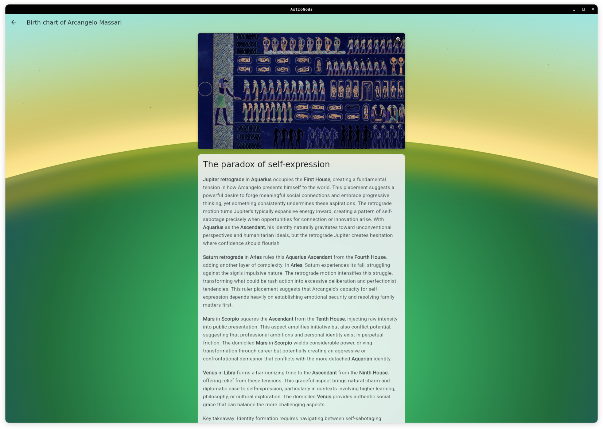
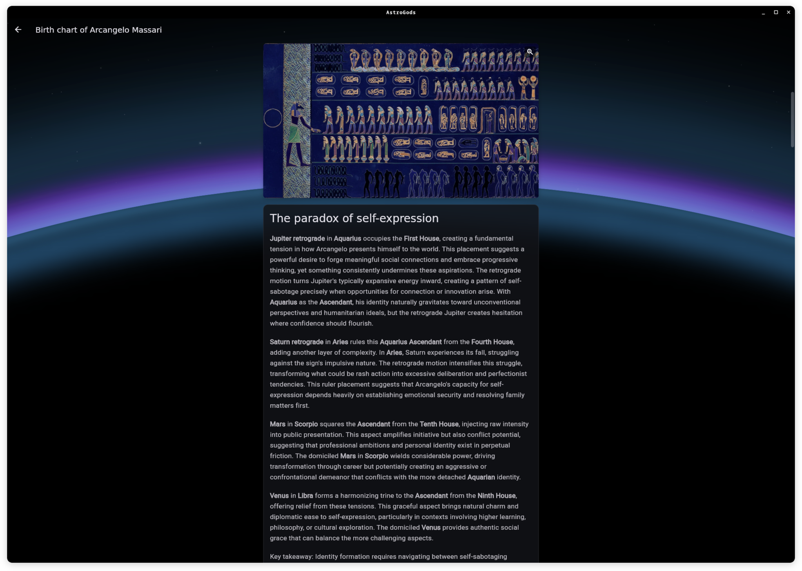
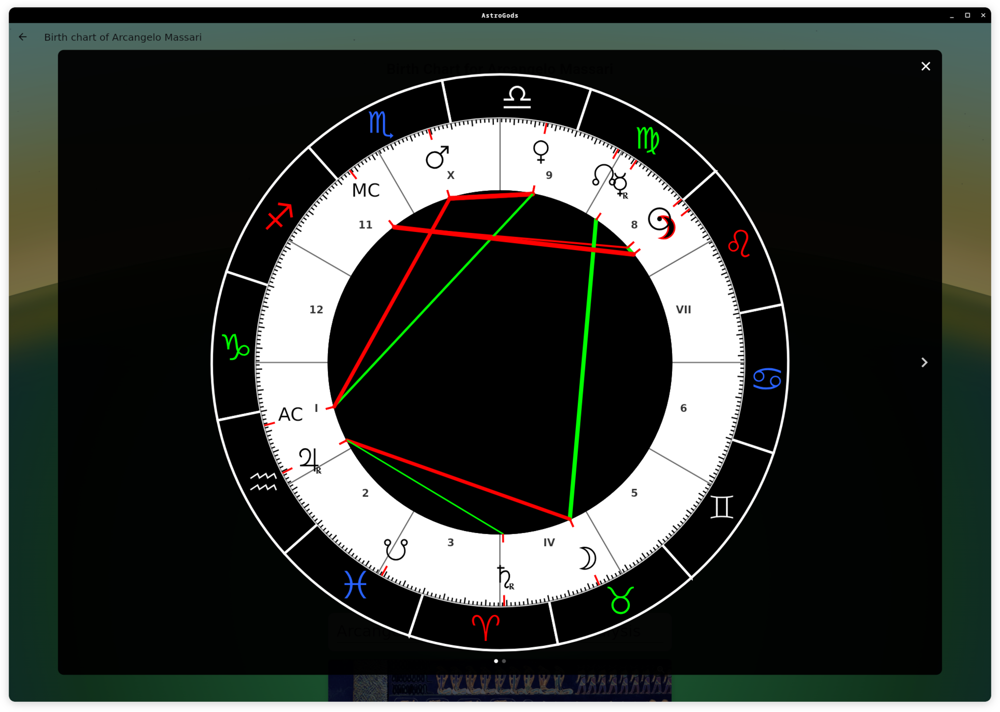
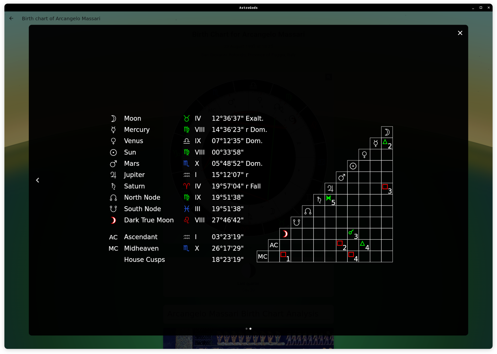

<p align="center">
  
</p>

# AstroGods

[](https://astrogods.it)
[](https://flathub.org/apps/it.astrogods.AstroGods)
[](https://snapcraft.io/astrogods)
[](https://apps.microsoft.com/detail/9mttm2qdm94v)

Open source Flutter frontend for [AstroGods](https://astrogods.it).

AstroGods is a modern, beautifully designed Astrology app focused on self-knowledge. It provides in-depth birth chart interpretations using Egyptian astrology (Equal house system with Vehlow domification), synastry analysis for relationships, and daily and monthly transit readings. Available in English and Italian.

https://github.com/user-attachments/assets/27aaa5fc-46b9-4fa5-90dc-c4479c725b5e

<p align="center">
  
  
</p>
<p align="center">
  
  
</p>

## Installation

### Linux

#### Flatpak

<a href="https://flathub.org/apps/it.astrogods.AstroGods">
  
</a>

```bash
flatpak install flathub it.astrogods.AstroGods
```

#### Snap

<a href="https://snapcraft.io/astrogods">
  
</a>

```bash
snap install astrogods
```

### Windows

<a href="https://apps.microsoft.com/detail/9mttm2qdm94v">
  
</a>

## License

This project is licensed under the [GNU Affero General Public License v3.0](LICENSE).

This repository contains the frontend. The backend is proprietary.

## Links

- Website: https://astrogods.it